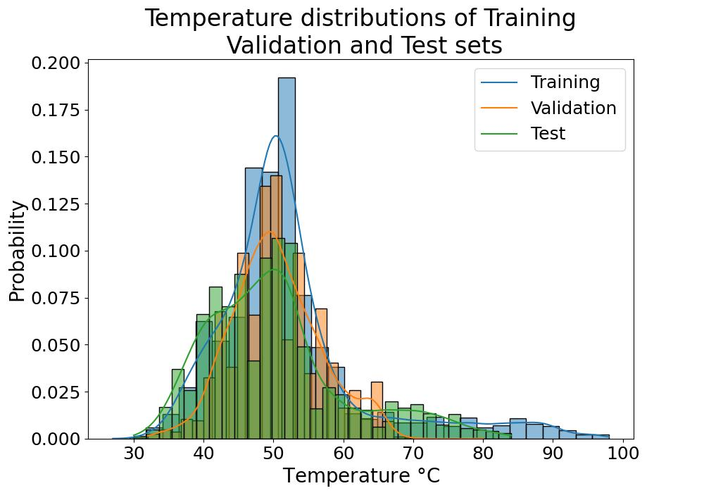

# Effective utilization of Protein Language models (pLM) for unbalanced biological data.
# 1 Abstract
Building dependable predictive models has gained significant importance in broadening the toolkits available to bioinformaticians. Nonetheless, many challenges persist, even with the exponential expansion of biological data, notably the scarcity and imbalance in high-quality labeled datasets. The demand for effective utilization of transfer learning approaches and strategies for handling imbalanced data is poised to grow further. In this work, we demonstrate how to leverage large protein language models (pLMs) to extract features, enabling the creation of more robust representations for a small, imbalanced dataset such as Jarzab et al.'s meltome dataset. Additionally, we employ upsampling techniques to enhance recall of the minority class.

All the codes to reproduce the results are available in this repository as notebooks.

# 2 Introduction and Background.
In the field of biotechnology, when encountering a novel sequence, whether it is DNA or a protein, there is often a need to gather additional information about it. This may include functional data, such as homology and function, or physical characteristics, such as solubility, stability, and structure. For most of these attributes, established methods like BLAST for identifying homologous sequences (Johnson et al., 2008) or homology modeling for predicting structure (Webb et al., A. 2016) have traditionally been used. However, there has been a recent surge of interest in developing new deep learning approaches to address these tasks.
For tasks like structure prediction and remote homology modeling, recent advancements like Alpha Fold 2 by Jumper et al. (2021) and ESM-1b by Rives et al. (2021) have demonstrated superior performance compared to classical approaches. These models have been trained on extensive datasets, some containing up to 10 million sequences in the case of ESM-1b. The importance of such large datasets in training machine learning models lies in their ability to facilitate the construction of rich data representations, enabling the model to effectively distinguish data points based on the target property. This underscores the scalability of machine learning methods with data volume—more data often leads to better internal data representations. 
However, most of the datasets used in biotechnology do not approach the same scale, not due to a lack of sequences per se but rather due to the scarcity of labeled data containing information about the property of interest. Such labels can only be acquired through costly experimental procedures. To address this data scarcity for specific tasks, transfer learning can be used, where features learned by models trained on other tasks are leveraged. Extracting features from protein language models (pLMs) like ESM-1b has proven effective for constructing classification models for small datasets (Rives et al., 2021). 
In addition to limited labeled samples, many biological datasets suffer from imbalances concerning their target variables. Complex machine learning models, such as neural networks, can be highly sensitive to these imbalances within their training data. Unfortunately, it is common that the regions where we have the fewest samples are precisely the regions of greatest interest. Therefore, it is crucial not only to assess the global performance of predictive models on the data but also to evaluate their performance in the specific use case of interest. In this work, we have conducted an evaluation of both transfer learning and resampling techniques to address the challenges posed by low sequence counts and imbalanced data in the Jarzab et al.'s meltome dataset.

Figure 1. a) PCA visualization of proteins embedded with ESM-1v. b) T-SNE dimensionality reduction of embedded proteins. 
Figure 1
# 3 Results
This section presents the results gathered when developing a methodology for implementing regression models based on average embeddings. We use a threshold of  60 °C to separate mesophilic and thermophilic proteins. Only the analysis of the data composition and the embedded features are done using the whole data set. All evaluations of trained models were done on the test set after hyperparameter optimization was completed.
## 3.1 Principal Component Analysis and nonlinear dimensionality reduction.
 PCA was performed to explore the distribution and separation of the proteins in the embedded dataset. The first principal components, PC1 and PC2, were extracted and analyzed for their ability to capture the underlying variation. For these two components, the combined variance was limited to ~18%, with the first component accounting for 14%. Plotting the two components in (Figure 1 a) reveals only a tiny separation between thermophilic and mesophilic proteins. To further investigate the separation between mesophilic and thermophilic proteins, T-SNE was employed as a non-linear dimensionality reduction technique. Plotting the two T-SNE components (Figure 1 b) showed only a marginal improvement in separating the two classes. In summary, the PCA and T-SNE analyses demonstrated that the proteins embedded using the ESM-1v model lack pronounced separation when projecting the data to lower dimensions. Coupled with the fact that the principal component individually contains only small parts of the variance of the data, further classification and regression tasks should utilize the full dimensionality of the embeddings. 

Figure 2. a)  Plot showing the range of Tm between sequences at different levels of sequence similarities. b) Plot showing the level of correlation between identity and Tm at different ranges of identity. 

## 3.2 Correlations between protein melting temperature (Tm) and protein similarity.
To avoid information leakage between our training, validation, and test set, it is good practice to cluster your sequences and split the data based on the clusters (AlQuraishi, 2019). The variance and correlation between Tm and sequence identity were calculated to determine the identity at which the data needed to be clustered. The identity at which the data were split was set to 60% based on the high variance of Tm and low correlation between identity and Tm, as shown in Figure 2 a,b. To establish that the distribution of Tm values did not deviate too much from one another, their histograms were compared (Figure 3). 

Figure 3. Histograms over temperature distributions of data after splitting into training, validation, and test sets. 

## 3.3 Predicting Tm with regression models.
To make a Tm predictor, both a standard linear model and a neural network were compared. Both the linear model parameters as well as the parameters for the neural network were manually tuned based on the performance of the validation set. Both models were then evaluated based on their performance on several metrics shown in Table 1. The neural network significantly outperforms the linear model on all metrics except the recall of the thermophiles, where it performs on par with the linear model. Plotting the predicted Tm from both models against the true temperature (Figure 4 a,b) further reveals that the neural network tends to overestimate Tm to a higher degree than the linear model. 

| | Linear model | Neural network |
| :--- | :---: | :---: |
| R2 | 0.25 | 0.40 |
| Standard error | 5.18 | 3.84 |
| Recall at 60 | 0.40 | 0.41 |
| Precision at 60 | 0.62 | 0.84 |
| F1 | 0.49 | 0.55 |

Table 1. Evaluation of linear model and neural network performance.  

Figure 4 a) Evaluation of linear model on the test set. b) Evaluation of neural network on test set

## 3.4 Increasing recall of thermophiles for neural networks by oversampling.
To increase the recall of thermophiles, two resampling methods were evaluated, sampling all Tm values a minimum of 500 times and uniformly sampling all Tm values. Both the different sampling methods increase the recall of thermophiles at the expense of the precision of the thermophiles, as seen in Figure 6. However, the harmonic mean of recall and precision (F1) shows no significant difference between the two sampling techniques. Further investigation by plotting the predicted against the real Tm for the two sampling techniques does not reveal any major difference between the two. 

Figure 5 a) Performance evaluation of minimum 500 sampling strategy. b) Performance evaluation of uniform sampling strategy

Figure 6. Evaluations of recall precision and F1 scores for different sampling strategies and baseline models. 

# 4 Discussion and conclusion
With the dataset utilized in this study, we have demonstrated a negative correlation between sequence identity and thermal stability for identities exceeding 60%. Consequently, it becomes imperative to cluster the data at a minimum of this threshold when partitioning it into training, validation, and test sets to mitigate the risk of information leakage. Moreover, for different tasks and datasets like structure prediction, clustering at even lower percentages has proven to be essential.

Large language models, such as ESM models, have potential uses far beyond what they were trained to do. In this work, we were able to outline a simple pipeline of how to utilize protein embeddings generated by such models. While we did not compare our model to those trained on more superficial sequence data representations like one-hot encoded sequences, the advantages of using fixed-dimensional embeddings often outweigh minor performance improvements. 

In both dimensionality reduction and temperature prediction tasks, we demonstrate that non-linear methods like T-SNE and neural networks outperform linear techniques such as linear regression and PCA. This suggests that the embeddings generated by ESM-1v possess rich non-linear dependencies that could extend beyond thermal stability prediction. 

While we did not directly compare the effects of transfer learning by embedding features from pLMs, we have seen from previous works in Li et al. (2022) that using a less rich representation of the sequence space, such as one hot encoding, benefits significantly with transferring learning. 

The data used in this work is heavily imbalanced, where most sequences were in the mesophilic range. However, we show that we can control the performance at different metrics, such as recall of thermophiles, by oversampling the data portions with few samples, such as the thermophilic range. The increase in recall did come with a detriment to other metrics, such as the precision of thermophiles. There exists a clear tradeoff between recall and precision that can be controlled by the level of oversampling. 

There are more sophisticated oversampling techniques that have demonstrated significant promise for handling other types of data. One such technique is known as SMOTE (Chawla, 2002), which interpolates between data points to mitigate the risk of overfitting in sparse regions when applying aggressive oversampling. Given the prevalence of unbalanced data in biotechnology, it will be important to investigate the efficacy of these sampling techniques for biological data such as protein embeddings. 

# 5 Methods and materials.
## 5.1 Data set
The protein dataset used in this study consisted of 48000 protein sequences from the meltome atlas published by Jarzab et al. (Jarzab et al., 2020). Prior to analysis, the dataset underwent initial preprocessing steps to ensure data quality and suitability for subsequent clustering and analysis. 
## 5.2 Protein pruning out redundancy with CD-HIT
To reduce redundancy within the protein dataset and capture representative sequences, the CD-HIT software was employed for clustering(Fu et al., 2012). CD-HIT is a widely used tool for sequence clustering based on sequence similarity, effectively grouping similar sequences into clusters while eliminating duplications. The clustering process was executed using a sequence similarity threshold of 95%, resulting in the formation of distinct clusters representing diverse protein sequences.
The first clustering step at 95% sequence similarity was intended to remove redundant sequences from the dataset, ensuring that only representative sequences were retained for downstream analysis.
## 5.3 Clustering and data partition of independent train, validation and test set.
For the purpose of model training, validation, and testing, an additional clustering step was performed using the mmseqs 2 tool (Steinegger et al., 2018). This time, the dataset was clustered at a lower sequence similarity threshold of 60%. The clusters obtained from this step were employed to construct independent data splits for training, validation, and testing.
The assembly of validation and test set were made using clusters containing only one sequence, to limit bias towards any clusters. Both validation and test set were constructed out of 3,000 such sequences. The remaining sequences were all placed in the training set.
## 5.4 Extracting embeddings from ESM-1v.
The ESM-1v (Evolutionary Scale Modeling) model has demonstrated significant capabilities in capturing complex patterns and features within protein sequences. To extract embeddings from this model, we employed a process that involved utilizing the final layer's outputs to obtain a meaningful representation of each protein sequence.
The ESM-1v model was initially pretrained on a vast corpus of protein sequences, learning to encode various sequence motifs, structural properties, and evolutionary relationships. The final layer of the model contains high-dimensional embeddings that encapsulate these learned features. In our study, we extracted embeddings for individual protein sequences by focusing on the averaged embeddings from this last layer.
## 5.5 Embedding Extraction Procedure
For each protein sequence in the dataset, we fed the sequence through the ESM-1v model and extracted per token embeddings from the last layer (Meier, 2021). The per token embeddings were then element-wise average over the feature dimension.  The embeddings obtained this way all had a dimension of 1280, which is independent of protein sequence length. 
## 5.6 Linear baseline model.
To make a linear baseline model, we used the sci-kit learn module SGDRegressor (Pedregosa, 2011). The linear model was trained using stochastic gradient descent with 1000 updates and a starting eta of 0.01. L2 regularization was used with a parameter of 0.0001. Mean squared error was used as the loss function when training the model.
## 5.7 Neural network architecture and training
As nonlinear models, neural networks were chosen. The networks have three fully connected hidden layers, each equipped with 200 nodes. Each hidden layer was accompanied by rectified linear unit (ReLU) activations. To regularize the networks, batch normalization and dropout were used after each hidden layer. The rate of dropout was set to 0.4 except for the layer right before the output, which had a rate of 0.2. The output layer consisted of a single node with linear activation. The loss function was set to be the mean squared error between predictions and targets. Adam optimization algorithm was employed, along with a learning rate of 0.001, beta1 of 0.9, and beta2 of 0.99. The models were trained for a maximum of 100 epochs with a batch size of 64. To save on computation and limit the risk of overfitting, early stopping was used. The model architecture and training were all implemented using Tensorflow 2(Abadi, 2016).
## 5.8 Oversampling techniques.
To sample the data, each sequence was first partitioned based on their melting temperature and rounded to its nearest whole number. The sequence was then sampled with replacement such that each temperature partition contained as many sequences as the partition with most sequences before sampling. The procedure for the 'min 500' strategy mirrored that of uniform sampling, with the distinction that only partitions containing fewer than 500 sequences were subjected to resampling, aiming to reach a total of 500.
# 6 References
Abadi, M., Barham, P., Chen, J., Chen, Z., Davis, A., Dean, J., ... & Zheng, X. (2016). {TensorFlow}: a system for {Large-Scale} machine learning. In 12th USENIX symposium on operating systems design and implementation (OSDI 16) (pp. 265-283).

AlQuraishi, M. (2019). ProteinNet: a standardized data set for machine learning of protein structure. BMC bioinformatics, 20(1), 1-10.

Chawla, N. V., Bowyer, K. W., Hall, L. O., & Kegelmeyer, W. P. (2002). SMOTE: synthetic minority over-sampling technique. Journal of artificial intelligence research, 16, 321-357.

Fu, L., Niu, B., Zhu, Z., Wu, S., & Li, W. (2012). CD-HIT: accelerated for clustering the next-generation sequencing data. Bioinformatics (Oxford, England), 28(23), 3150–3152. https://doi.org/10.1093/bioinformatics/bts565

Li, G., Buric, F., Zrimec, J., Viknander, S., Nielsen, J., Zelezniak, A., & Engqvist, M. K. (2022). Learning deep representations of enzyme thermal adaptation. Protein Science, 31(12), e4480.

Jarzab, A., Kurzawa, N., Hopf, T., Moerch, M., Zecha, J., Leijten, N., ... & Kuster, B. (2020). Meltome atlas—thermal proteome stability across the tree of life. Nature methods, 17(5), 495-503.

Johnson, M., Zaretskaya, I., Raytselis, Y., Merezhuk, Y., McGinnis, S., & Madden, T. L. (2008). NCBI BLAST: a better web interface. Nucleic acids research, 36(suppl_2), W5-W9.
Jumper, J., Evans, R., Pritzel, A., Green, T., Figurnov, M., Ronneberger, O., ... & Hassabis, D. (2021). Highly accurate protein structure prediction with AlphaFold. Nature, 596(7873), 583-589.

Meier, J., Rao, R., Verkuil, R., Liu, J., Sercu, T., & Rives, A. (2021). Language models enable zero-shot prediction of the effects of mutations on protein function. Advances in Neural Information Processing Systems, 34, 29287-29303.

Pedregosa, F., Varoquaux, G., Gramfort, A., Michel, V., Thirion, B., Grisel, O., ... & Duchesnay, É. (2011). Scikit-learn: Machine learning in Python. the Journal of machine Learning research, 12, 2825-2830.

Rives, A., Meier, J., Sercu, T., Goyal, S., Lin, Z., Liu, J., ... & Fergus, R. (2021). Biological structure and function emerge from scaling unsupervised learning to 250 million protein sequences. Proceedings of the National Academy of Sciences, 118(15), e2016239118.

Steinegger, M.,&Söding, J. (2018). Clustering huge protein sequence sets in linear time. Nature communications, 9(1), 2542.

Webb, B., & Sali, A. (2016). Comparative protein structure modeling using MODELLER. Current protocols in bioinformatics, 54(1), 5-6.

